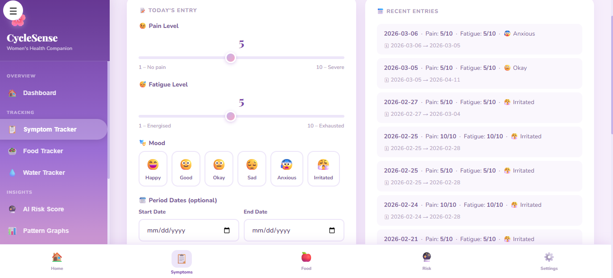

<p align="center">
  
</p>

# [Project Name] 🎯CYCLE SENSE

## Basic Details CYCLE SENSE IS A FULL STACK AI POWERED WOMEN HEALTH RELATED WEBSITE DESIGNED TO SUPPORT EARLY RISK AWARENESS ,HEALTH TRACKING AND PREVENTVE CARE FOR CONDITIONS LIKE PCO'S AND ENDOMETRIOSIS.IT GOES BEYOND BASIC TRACKING BY ANALYSING PATTERNS AND GENERATING MEANINGFUL INSIGHTS FOR USERS AND DOCTORS.

### Team Name: TECH TITANS

### Team Members
- Member 1: NANDANA JV - College of Engineering Attingal
- Member 2: NADIYA S - College of Engineering Attingal

### Hosted Project Link
[mention your project hosted link here]

### Project Description
[2-3 lines about what your project does]

### The Problem statement
 Conditions like PCOS and Endometriosis are often diagnosed late due to irregular symptoms and lack of early awareness. Most existing health apps only track menstrual cycles without analyzing patterns or providing meaningful insights. This leaves women with fragmented data and delayed medical support. There is a need for an intelligent system that analyzes health data, detects early risk patterns, and supports preventive women’s healthcare.

### The Solution
CycleSense is an AI-powered women’s health companion that goes beyond basic tracking by analyzing menstrual, symptom, and lifestyle data to detect early risk patterns for conditions like PCOS and Endometriosis. It visualizes health trends, generates doctor-ready reports, and supports preventive healthcare through intelligent insights and easy access to medical consultation.

---

## Technical Details

### Technologies/Components Used

**For Software:**
- Languages used:JavaScript
- Frameworks used:React.js (Frontend)

Node.js with Express.js (Backend)
- Libraries used: Tailwind CSS – UI styling

Chart.js – Data visualization

Axios – API communication
- Tools used:VS Code – Development

Git & GitHub – Version control

Postman – API testing

**For Hardware:**
- Main components:no hardware components used
- Specifications: [Technical specifications]
- Tools required: [List tools needed]

---

## Features

List the key features of your project:
- Feature 1: Symptom Tracker: Allows users to log pain levels, fatigue, mood changes, and menstrual cycle dates for continuous health monitoring.
- Feature 2:Food Tracker: Records daily food intake and categorizes items such as sugar, junk food, and caffeine to identify food–health correlations.
- Feature 3:AI Risk Score: Analyzes symptom frequency and cycle irregularities to generate an early risk level (Low / Medium / High) for PCOS and Endometriosis.
- Feature 4:Pattern Visualization: Displays interactive charts showing trends in pain, fatigue, and cycle length to help users understand their health patterns.
---

## Implementation

### For Software:

#### Installation
```bash
# Clone the repository
git clone https://github.com/your-username/cyclesense.git

# Navigate to project directory
cd cyclesense

# Install frontend dependencies
cd client
npm install

# Install backend dependencies
cd ../server
npm install
```

#### Run
```bash
# Start backend server
cd server
npm start

# Start frontend application (in a new terminal)
cd client
npm start

### For Hardware:
hardware components are not used in the project.

#### Components Required
[List all components needed with specifications]

#### Circuit Setup
[Explain how to set up the circuit]

---

## Project Documentation

### For Software:

#### Screenshots (Add at least 3)

![Screenshot1]! [frontpage] (image.png)
it shows the basic front page of the website

![Screenshot2]![second page] (image-1.png))
it shows the second page f the website

![Screenshot3])
it shows the third page of the website

#### Diagrams

**System Architecture:**

![Architecture Diagram]
User / Client

Users access the application via a web browser on desktop or mobile.

Input data includes symptoms, cycle details, and food logs.

Frontend (React.js + Tailwind CSS)

Handles user interface, form inputs, and visualization of charts (Chart.js).

Sends requests to the backend API.

Backend (Node.js + Express.js)

Processes requests, validates user data, and interacts with the database.

Performs AI-based risk calculations using historical symptoms and cycle data.

Database (MySQL)

Stores user information, cycle history, symptom logs, and food data securely.

Supports querying for trend analysis and AI pattern detection.

AI Risk Analysis Module

Calculates risk scores for PCOS and Endometriosis based on patterns in the data.

Outputs risk levels: Low / Medium / High.

Doctor Summary Report Generator

Compiles user data, patterns, and AI risk score into a downloadable PDF.

Helps doctors quickly understand a patient’s health history.

Data Flow

User → Frontend → Backend → MySQL Database → AI Risk Analysis → Report Generation → Frontend

---


#### Build Photos


*List out all components shown*


*Explain the build steps*


*Explain the final build*

---

## Additional Documentation

### For Web Projects with Backend:

#### API Documentation

**Base URL:** http://127.0.0.1:5504/cyclesense/

##### Endpoints

**GET /api/endpoint**
- **Description:**Fetches all logged symptoms for the authenticated user.
- **Parameters:**
  - userId (string): ID of the user whose symptoms are fetched
  
- **Response:**
```json
{
  "status": "success",
  "data": [
    {
      "date": "2026-02-21",
      "painLevel": 3,
      "fatigue": 2,
      "mood": "neutral",
      "cycleDay": 5
    }
  ]
}

{
  "status": "success",
  "data": {}
}
```

**POST /api/endpoint**
- **Description:**Adds a new symptom entry for the user.
- **Request Body:**
```json

 {
  "userId": "12345",
  "date": "2026-02-21",
  "painLevel": 3,
  "fatigue": 2,
  "mood": "neutral",
  "cycleDay": 5
}
{
  
}

  "field1": "value1",
  "field2": "value2"
}
```
- **Response:**
```json
{
  "status": "success",
  "message": "Symptom logged successfully"
}
{
  "status": "success",
  "message": "Operation completed"
}
```

[Add more endpoints as needed...]

---

### For Mobile Apps:

#### App Flow Diagram
User → Frontend (React.js + Tailwind CSS)
      │
      ▼
Data Input: Symptoms, Cycle, Food Logs
      │
      ▼
Backend (Node.js + Express.js)
      │
      ▼
Database (MySQL)
      │
      ▼
AI Risk Analysis Module
      │
      ▼
Pattern Visualization (Chart.js) → Dashboard
      │
      ▼
Doctor Summary Report → Downloadable PDF
      │
      ▼
Optional: Find Doctors → Consultation Requests
**Building from Source:**
```bash
# For Android
flutter build apk
# or
./gradlew assembleDebug

# For iOS
flutter build ios
# or
xcodebuild -workspace App.xcworkspace -scheme App -configuration Debug
```

---


### For Scripts/CLI Tools:

#### Command Reference

**Basic Usage:**
```bash
node <script-name>.js [options] [arguments]

```

**Available Commands:**
node seedDatabase.js – Populate MySQL database with sample data for testing

node calculateAIRisk.js [userId] – Run AI risk analysis for a specific user

node generateReport.js [userId] – Generate doctor summary report for a user

node cleanupOldData.js – Remove outdated records from the database

**Options:**
-h, --help – Show help message and exit

-v, --verbose – Enable detailed logging output

-o, --output FILE – Specify output file path for reports

-c, --config FILE – Specify custom configuration file

--version – Show version information


#### Demo Output

**Example 1: Basic Processing**

**Input:**
{
  "userId": "12345",
  "date": "2026-02-21",
  "painLevel": 3,
  "fatigue": 2,
  "mood": "neutral",
  "cycleDay": 5
}

**Command:**
```bash
node seedDatabase.js
```

**Output:**
{
  "status": "success",
  "message": "Symptom logged successfully"
}

**Example 2: Advanced Usage**

**Input:**
{
  "userId": "12345",
  "symptoms": [
    {"date": "2026-02-21", "painLevel": 3, "fatigue": 2, "mood": "neutral", "cycleDay": 5},
    {"date": "2026-02-22", "painLevel": 4, "fatigue": 3, "mood": "tired", "cycleDay": 6}
  ],
  "cycleHistory": [
    {"month": "Jan", "length": 28},
    {"month": "Feb", "length": 30}
  ]

**Command:**
```bash
node calculateAIRisk.js --userId 12345 --verbose --output json
```

**Output:**
[VERBOSE] Fetching user data from database...
[VERBOSE] Parsing symptom and cycle history...
[VERBOSE] Running AI risk analysis...
{
  "status": "success",
  "processed": true,
  "data": {
    "riskLevel": "Medium",
    "condition": "PCOS",
    "score": 0.65,
    "recommendation": "Monitor symptoms and consult a gynecologist if pain increases."
  }
}
[VERBOSE] AI risk calculation completed in 0.42s
## Project Demo

### Video
<video controls src=https://drive.google.com/file/d/1hu1yAPc3sWs-KJteWQ6yT1W4bIp4Dc5-/view?usp=sharing
it shows the basic view of the website and how it works.


### Additional Demos
http://127.0.0.1:5504/cyclesense/

---

## AI Tools Used (Optional - For Transparency Bonus)

If you used AI tools during development, document them here for transparency:

**Tool Used:**  GitHub ,ChatGPT,antigravity


**Human Contributions:**
- Architecture design and planning
- Custom business logic implementation
- Integration and testing
- UI/UX design decisions

*Note: Proper documentation of AI usage demonstrates transparency and earns bonus points in evaluation!*

---

Nandana J V: Frontend development (React.js, Tailwind CSS), Dashboard & Pattern Visualization, Presentation preparation.

Nadiya S: Backend development (Node.js, Express.js), AI risk analysis module, API integration.
---

## License

This project is licensed under the [LICENSE_NAME] License - see the [LICENSE](LICENSE) file for details.

**Common License Options:**
- MIT License (Permissive, widely used)
- Apache 2.0 (Permissive with patent grant)
- GPL v3 (Copyleft, requires derivative works to be open source)

---

Made with ❤️ at TinkerHub

