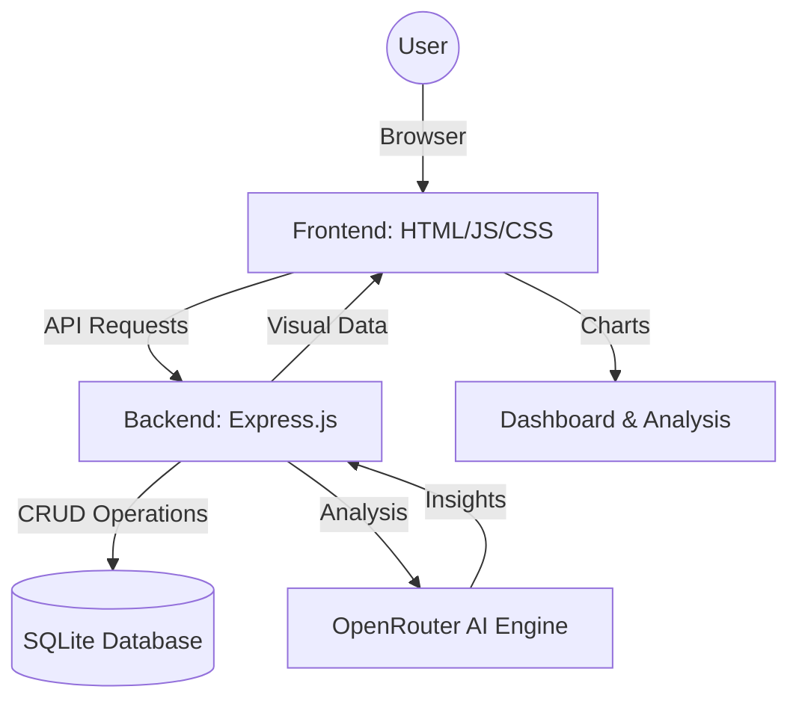
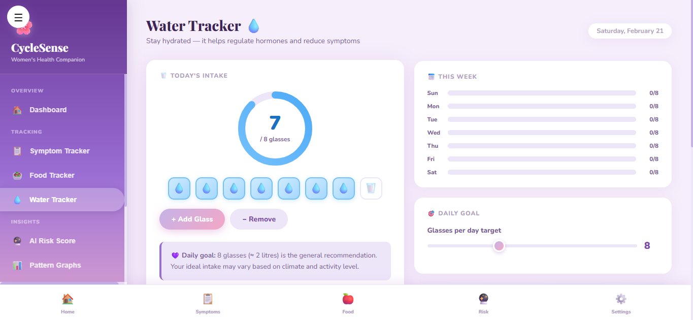

<p align="center">
  
</p>

# CycleSense 🎯

## Basic Details
**CycleSense** is a full-stack, AI-powered women's health platform designed to support early risk awareness, health tracking, and preventive care for conditions like PCOS and Endometriosis. It goes beyond basic tracking by analyzing patterns and generating meaningful insights for both users and medical professionals.

### Team Name: TECH TITANS
- **Member 1**: Nandana JV - College of Engineering Attingal
- **Member 2**: Nadiya S - College of Engineering Attingal

<p align="center">
  
</p>

### Hosted Project Link
[Live Demo on Render](https://tink-her-hack-temp-v3lb.onrender.com/)

### Project Description
CycleSense is an AI-powered women’s health companion designed to help women track, monitor, and understand their reproductive health. By analyzing symptoms, menstrual cycles, and lifestyle data, it detects early risk patterns for conditions like PCOS and Endometriosis, providing users with a proactive approach to their wellbeing.

---

## 💡 The Problem Statement
Conditions like PCOS and Endometriosis are often diagnosed late due to irregular symptoms and a lack of early awareness. Most existing health apps only track menstrual cycles without analyzing patterns or providing meaningful insights. This leaves women with fragmented data and delayed medical support.

## 🚀 The Solution
CycleSense solves this by analyzing menstrual, symptom, and lifestyle data to detect early risk patterns. It visualizes health trends through interactive charts, generates data-driven risk scores, and provides intelligent AI-powered suggestions to support preventive healthcare.

---

## 🛠️ Technical Details

### Technologies Used
| Category | Technology |
| :--- | :--- |
| **Frontend** | Vanilla JavaScript, HTML5, CSS3 |
| **Backend** | Node.js, Express.js |
| **Database** | SQLite (Sequelize ORM) |
| **AI/ML** | OpenRouter AI (Gemini Flash) |
| **Data Viz** | Chart.js |
| **Version Control** | Git & GitHub |

---

## ✨ Key Features
- **Symptom Tracker**: Log pain levels, fatigue, mood, and cycle dates for continuous monitoring.
- **Food Tracker**: Record dietary habits to identify correlations between nutrition and health.
- **AI Risk Score**: Advanced weighted algorithm that identifies risk levels (Low/Medium/High) for PCOS/Endo.
- **Smart AI Suggestions**: Personalized real-time health advice powered by OpenRouter AI.
- **Pattern Visualization**: Interactive trend analysis for pain, fatigue, and cycle regularity.

---

## 📦 Implementation

### Installation & Local Setup

1. **Clone the repository**
   ```bash
   git clone https://github.com/your-username/cyclesense.git
   cd cyclesense
   ```

2. **Install Dependencies**
   ```bash
   npm install
   ```

3. **Configure Environment**
   Create a `.env` file in the root directory and add:
   ```env
   PORT=5000
   OPENROUTER_API_KEY=your_api_key_here
   ```

4. **Run the Application**
   ```bash
   npm start
   ```
   Open your browser and navigate to `http://localhost:5000`.

---

## 📊 System Architecture



---

## 📸 Screenshots

<p align="center">
  
  <br><i>Dashboard: Quick overview of cycle and health stats</i>
</p>

<p align="center">
  
  <br><i>Symptom Tracker: Log and monitor daily wellness metrics</i>
</p>

<p align="center">
  
  <br><i>AI Analysis: Personalized risk score and health suggestions</i>
</p>

---

## 🎬 Project Demo

### Video
[Watch the Project Demo Video](https://drive.google.com/file/d/1hu1yAPc3sWs-KJteWQ6yT1W4bIp4Dc5-/view?usp=sharing)
*The video demonstrates the complete user flow from symptom logging to AI-generated risk analysis.*

---

## 🤖 AI Tools Used
- **GitHub Copilot / Antigravity**: For boilerplate generation and logic assistance.
- **ChatGPT**: For prompt engineering and documentation refinement.

---

## 🤝 Team Contributions
- **Nandana JV**: Frontend development, Dashboard UI, Data Visualization (Chart.js), and Documentation.
- **Nadiya S**: Backend API development (Node.js/Express), Database design, and AI Risk Module integration.


---
<p align="center">Made with ❤️ at TinkerHub</p>
